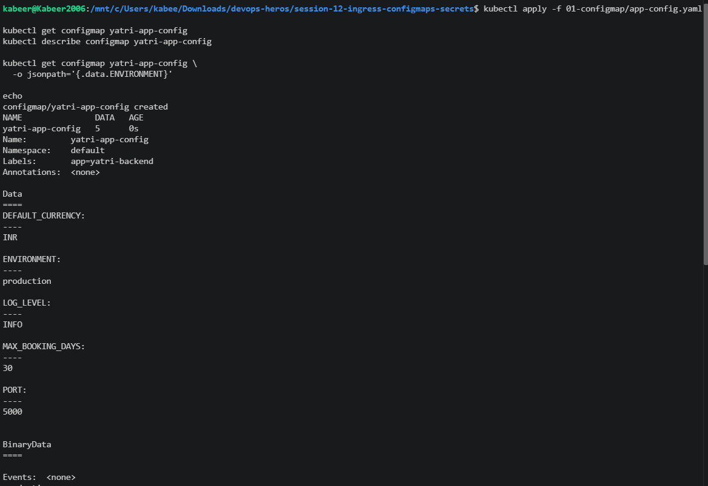
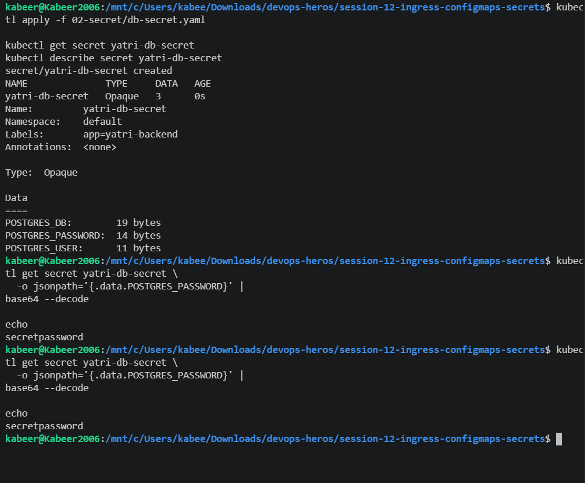
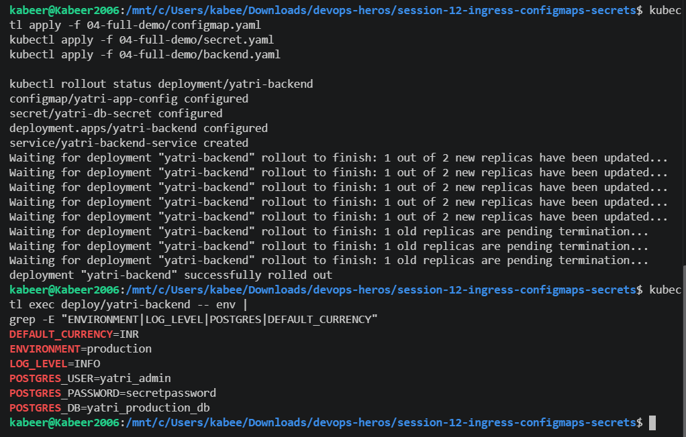
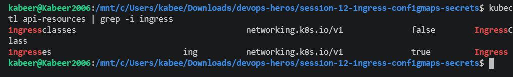
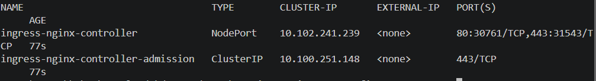
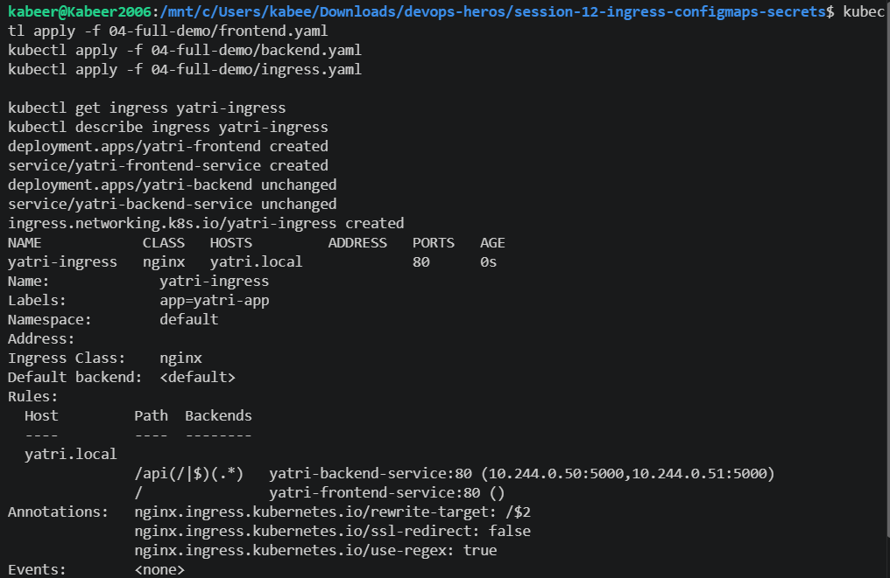
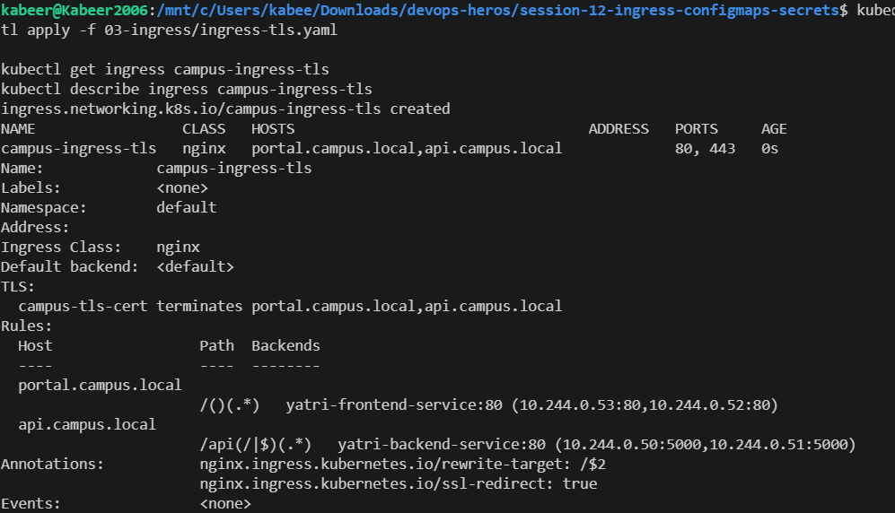
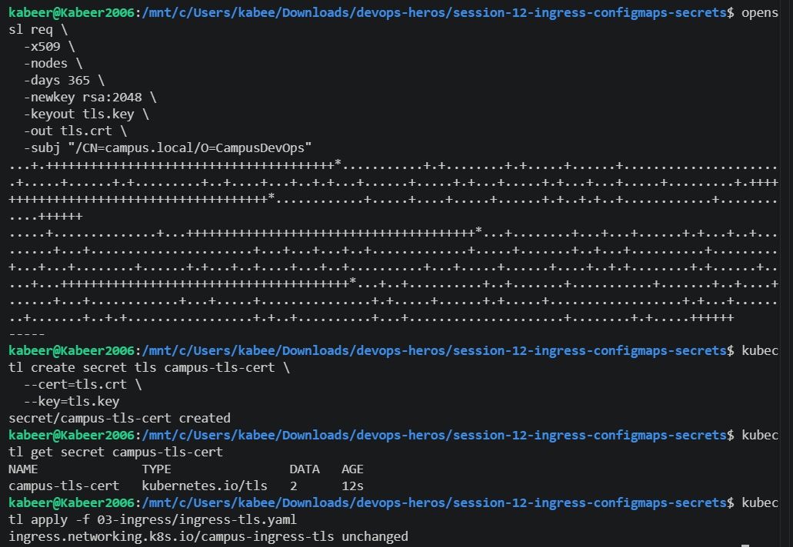

# Session 12: ConfigMaps, Secrets & Ingress

**Author:** [Your Name]  
**Course:** SST DevOps & Cloud [SWE]  
**Session:** 12  
**Repository Directory:** `session-12-ingress-configmaps-secrets`

> **Submission note:** The commands and task structure below are based on the supplied **DevOps Assignment Season 2** Markdown. Obvious URL-formatting artifacts caused by Markdown rendering have been normalized so the shell commands are copyable. Terminal output is machine-specific, so every task contains a placeholder that must be replaced with your real output before submission.


```bash
mkdir -p screenshots
```

Start from the directory used by the supplied assignment:

```bash
cd session-12-ingress-configmaps-secrets
```

---
## Task 1: Non-Sensitive Configuration Decoupling via ConfigMaps

- **Short Description:** Decouple environment-specific runtime configurations (log levels, ports, currency settings) from container images by storing them in a declarative `ConfigMap`.
- **Workflow:**
    1. Review `01-configmap/app-config.yaml`.
    2. Apply the manifest to the cluster.
    3. Inspect the stored keys and verify the payload using `describe` and JSONPath queries.
- **Commands to Run:**
    
    ```bash
    kubectl apply -f 01-configmap/app-config.yaml
    kubectl get configmap yatri-app-config
    kubectl describe configmap yatri-app-config
    kubectl get configmap yatri-app-config -o jsonpath='{.data.ENVIRONMENT}' && echo ""
    kubectl get configmap yatri-app-config -o jsonpath='{.data.LOG_LEVEL}' && echo ""
    ```

### Solution / Observation

The ConfigMap externalizes non-sensitive runtime values from the container image. `describe` should show the configured keys and JSONPath should return the selected value, such as `production` for `ENVIRONMENT`.

### Actual Terminal Output

Replace the placeholder below with the output from **your own machine**. Do not submit the sample/expected output as if it were your execution.

```text
PASTE YOUR ACTUAL TERMINAL OUTPUT FOR TASK 1 HERE
```

### Screenshot

Combine the required evidence for this task into one screenshot and save it as `screenshots/task1.png`.



---

## Task 2: ConfigMap Live Update & Pod Immobility Verification Drill

- **Short Description:** Demonstrate that updating a `ConfigMap` does **not** retroactively update environment variables inside active running containers, and use `kubectl rollout restart` to trigger a zero-downtime rolling update.
- **Workflow:**
    1. Patch the active `yatri-app-config` ConfigMap to change `ENVIRONMENT` from `production` to `staging`.
    2. Query the running pod's environment directly using `kubectl exec` to show that the variable did not change.
    3. Perform a rolling restart on the deployment.
    4. Verify the new pod instances picked up `ENVIRONMENT=staging`.
- **Commands to Run:**
    
    ```bash
    # Step 1: Patch ConfigMap live
    kubectl patch configmap yatri-app-config --type merge -p '{"data":{"ENVIRONMENT":"staging"}}'
    
    # Step 2: Check running pod env (assuming backend pod from 04-full-demo is running)
    kubectl exec -it deploy/yatri-backend -- env | grep ENVIRONMENT
    
    # Step 3: Trigger rolling restart
    kubectl rollout restart deployment/yatri-backend
    kubectl rollout status deployment/yatri-backend
    
    # Step 4: Re-check pod env
    kubectl exec -it deploy/yatri-backend -- env | grep ENVIRONMENT
    
    # Step 5: Revert patch for subsequent labs
    kubectl patch configmap yatri-app-config --type merge -p '{"data":{"ENVIRONMENT":"production"}}'
    kubectl rollout restart deployment/yatri-backend
    ```

### Solution / Observation

Environment variables sourced from a ConfigMap are fixed for the lifetime of the running container. Patching the ConfigMap alone does not rewrite those variables; restarting the Deployment creates new Pods that read the updated ConfigMap values.

### Actual Terminal Output

Replace the placeholder below with the output from **your own machine**. Do not submit the sample/expected output as if it were your execution.

```text
PASTE YOUR ACTUAL TERMINAL OUTPUT FOR TASK 2 HERE
```

### Screenshot

Combine the required evidence for this task into one screenshot and save it as `screenshots/task2.png`.


---

## Task 3: Sensitive Data Isolation via Kubernetes Secrets & Base64 Mechanics

- **Short Description:** Implement credential isolation using an `Opaque` Kubernetes `Secret`, illustrating that Base64 is merely an encoding scheme (not encryption) that can be decoded on the CLI.
- **Workflow:**
    1. Review `02-secret/db-secret.yaml`.
    2. Apply the manifest to store database user and password credentials.
    3. Verify that `kubectl describe secret` masks the values for security.
    4. Imperatively extract and decode the password to confirm the plaintext value.
- **Commands to Run:**
    
    ```bash
    kubectl apply -f 02-secret/db-secret.yaml
    kubectl get secret yatri-db-secret
    kubectl describe secret yatri-db-secret
    kubectl get secret yatri-db-secret -o jsonpath='{.data.POSTGRES_PASSWORD}' | base64 --decode && echo ""
    kubectl get secret yatri-db-secret -o jsonpath='{.data.POSTGRES_USER}' | base64 --decode && echo ""
    ```

### Solution / Observation

The Secret separates sensitive credentials from ordinary configuration, but Base64 itself is not encryption. The JSONPath-plus-`base64 --decode` commands intentionally demonstrate that a user with read access can recover the plaintext.

### Actual Terminal Output

Replace the placeholder below with the output from **your own machine**. Do not submit the sample/expected output as if it were your execution.

```text
PASTE YOUR ACTUAL TERMINAL OUTPUT FOR TASK 3 HERE
```

### Screenshot

Combine the required evidence for this task into one screenshot and save it as `screenshots/task3.png`.



---

## Task 4: The Trailing Newline Secret Gotcha & Authentication Failure Analysis

- **Short Description:** Analyze the common authentication bug where encoding with standard `echo` appends an invisible ASCII newline (`\n` / `0x0A`), corrupting passwords sent to backend databases.
- **Workflow:**
    1. Encode a test string with standard `echo` and inspect its hexadecimal binary representation using `xxd` or `hexdump`.
    2. Encode the test string with `echo -n` to demonstrate suppression of the newline byte.
    3. Decode both strings to document the payload corruption.
- **Commands to Run:**
    
    ```bash
    # Broken pattern: appends 0x0a (\n)
    echo "secretpassword" | xxd
    echo "secretpassword" | base64
    
    # Correct pattern: exact byte stream
    echo -n "secretpassword" | xxd
    echo -n "secretpassword" | base64
    
    # Visual comparison
    echo "Wrong (with newline): $(echo "secretpassword" | base64)"
    echo "Right (no newline):   $(echo -n "secretpassword" | base64)"
    ```

### Solution / Observation

Plain `echo` appends a newline byte (`0x0a`), changing the encoded credential. `echo -n` emits the exact password bytes, avoiding a hidden character that can make database/application authentication fail.

### Actual Terminal Output

Replace the placeholder below with the output from **your own machine**. Do not submit the sample/expected output as if it were your execution.

```text
PASTE YOUR ACTUAL TERMINAL OUTPUT FOR TASK 4 HERE
```

### Screenshot

Combine the required evidence for this task into one screenshot and save it as `screenshots/task4.png`.


---

## Task 5: Enterprise Secret Management & Pipeline Integration Analysis

- **Short Description:** Research and document how real-world enterprise architectures solve Kubernetes secret management securely without committing Base64 strings to source control.
- **Workflow:**
    1. Write an architectural summary in your `README.md` covering:
        - **The Vulnerability:** Why committing `Secret` YAMLs to Git violates DevSecOps (Git history retention, RBAC exposure, lack of rotation).
        - **External Secret Operators:** How **External Secrets Operator (ESO)** or **HashiCorp Vault Agent Injector** synchronizes credentials from AWS Secrets Manager, Azure Key Vault, or HashiCorp Vault into ephemeral Kubernetes secrets.
        - **CI/CD Integration:** How GitHub Actions secrets or Azure DevOps Variable Groups inject secrets dynamically at deploy time without storing them in manifest repositories.
- **Commands / References to Run:**
    
    ```bash
    # Check if any secret operator or CRDs exist in your cluster
    kubectl get crds | grep -i secret || echo "Standard native secrets in use"
    ```

### Solution / Observation

The write-up should explain why Git-hosted Base64 Secret YAML is a security anti-pattern and describe an external secret store/operator or CI/CD-injection flow so credentials are retrieved at deployment/runtime instead of hardcoded in source control.

### Actual Terminal Output

Replace the placeholder below with the output from **your own machine**. Do not submit the sample/expected output as if it were your execution.

```text
PASTE YOUR ACTUAL TERMINAL OUTPUT FOR TASK 5 HERE
```

### Screenshot

Combine the required evidence for this task into one screenshot and save it as `screenshots/task5.png`.


---

## Task 6: Combined ConfigMap and Secret Pod Injection Architecture

- **Short Description:** Deploy a backend pod that simultaneously consumes configuration from both a `ConfigMap` and a `Secret`, verifying that both sources merge cleanly into the container's environment.
- **Workflow:**
    1. Review `04-full-demo/backend.yaml` to observe `envFrom.configMapRef` and `env.valueFrom.secretKeyRef`.
    2. Deploy the backend application and its corresponding `ClusterIP` Service.
    3. Execute `env` inside the running container to verify the coexistence of both datasets.
- **Commands to Run:**
    
    ```bash
    kubectl apply -f 04-full-demo/configmap.yaml
    kubectl apply -f 04-full-demo/secret.yaml
    kubectl apply -f 04-full-demo/backend.yaml
    kubectl rollout status deployment/yatri-backend
    
    # Verify injection inside pod
    kubectl exec -it deploy/yatri-backend -- env | grep -E "ENVIRONMENT|LOG_LEVEL|POSTGRES|DEFAULT_CURRENCY"
    ```

### Solution / Observation

The backend demonstrates two injection paths at the same time: bulk non-sensitive configuration through `envFrom.configMapRef` and individual sensitive values through `secretKeyRef`. The `env` check is the runtime proof.

### Actual Terminal Output

Replace the placeholder below with the output from **your own machine**. Do not submit the sample/expected output as if it were your execution.

```text
PASTE YOUR ACTUAL TERMINAL OUTPUT FOR TASK 6 HERE
```

### Screenshot

Combine the required evidence for this task into one screenshot and save it as `screenshots/task6.png`.



---

## Task 7: Architectural Comparative Study — Ingress Resource vs. Ingress Controller

- **Short Description:** Provide a conceptual and technical breakdown of the division of responsibilities between an `Ingress` rule manifest and an `Ingress Controller`.
- **Workflow:**
    1. Document the comparison table in your report:
        - **Ingress Resource:** Declarative Kubernetes Layer 7 API specification (contains hostnames, paths, TLS cert references, target service names). Does nothing by itself.
        - **Ingress Controller:** Active reverse proxy pod (NGINX, Traefik, HAProxy, Envoy) that runs a control loop, monitors the API Server for `Ingress` objects, dynamically generates proxy configuration (e.g., `nginx.conf`), and reloads its engine to route real network traffic.
- **Commands to Run:**
    
    ```bash
    # Show that Ingress API exists natively
    kubectl api-resources | grep -i ingress
    ```

### Solution / Observation

An Ingress resource is declarative routing configuration; an Ingress Controller is the active data/control-plane implementation that watches those resources and configures a proxy such as NGINX to handle traffic.

### Actual Terminal Output

Replace the placeholder below with the output from **your own machine**. Do not submit the sample/expected output as if it were your execution.

```text
PASTE YOUR ACTUAL TERMINAL OUTPUT FOR TASK 7 HERE
```

### Screenshot

Combine the required evidence for this task into one screenshot and save it as `screenshots/task7.png`.



---

## Task 8: NGINX Ingress Controller Activation & Lifecycle Verification

- **Short Description:** Enable and verify the NGINX Ingress Controller daemon on Minikube, validating the pod lifecycle within the `ingress-nginx` namespace.
- **Workflow:**
    1. Enable the Minikube Ingress addon.
    2. Observe the creation of the Ingress Controller deployment, pods, and admission webhooks.
    3. Wait until the controller pod reaches a healthy `Running` and `Ready` state.
- **Commands to Run:**
    
    ```bash
    minikube addons enable ingress
    kubectl get pods -n ingress-nginx
    kubectl wait --namespace ingress-nginx \
      --for=condition=ready pod \
      --selector=app.kubernetes.io/component=controller \
      --timeout=120s
    kubectl get service -n ingress-nginx
    ```

### Solution / Observation

The task is complete when the Minikube ingress addon has created the `ingress-nginx` controller resources and the controller Pod reaches `Running` and `Ready` state.

### Actual Terminal Output

Replace the placeholder below with the output from **your own machine**. Do not submit the sample/expected output as if it were your execution.

```text
PASTE YOUR ACTUAL TERMINAL OUTPUT FOR TASK 8 HERE
```

### Screenshot

Combine the required evidence for this task into one screenshot and save it as `screenshots/task8.png`.



---

## Task 9: Local DNS Resolution & System Hosts File Mapping

- **Short Description:** Configure host-level local DNS name resolution by binding the Minikube VM/Docker IP to the custom domain `yatri.local` in `/etc/hosts`.
- **Workflow:**
    1. Retrieve the Minikube cluster IP address.
    2. Append the hostname mapping to your local workstation's `/etc/hosts` file.
    3. Ping or query the domain locally to confirm resolution.
- **Commands to Run:**
    
    ```bash
    MINIKUBE_IP=$(minikube ip)
    echo "Minikube IP is: ${MINIKUBE_IP}"
    
    # Append to /etc/hosts if not already present
    if ! grep -q "yatri.local" /etc/hosts; then
      echo "${MINIKUBE_IP}  yatri.local" | sudo tee -a /etc/hosts
    fi
    
    # Verify entry
    grep "yatri.local" /etc/hosts
    ```

### Solution / Observation

The local hosts-file entry makes `yatri.local` resolve to the Minikube address without public DNS. The screenshot should show the same Minikube IP in both the `minikube ip` result and the hosts-file mapping.

### Actual Terminal Output

Replace the placeholder below with the output from **your own machine**. Do not submit the sample/expected output as if it were your execution.

```text
PASTE YOUR ACTUAL TERMINAL OUTPUT FOR TASK 9 HERE
```

### Screenshot

Combine the required evidence for this task into one screenshot and save it as `screenshots/task9.png`.


---

## Task 10: Layer 7 Path-Based Routing Implementation

- **Short Description:** Implement path-based Layer 7 traffic routing using an Ingress resource, directing `/` to the frontend Nginx service and `/api/*` to the backend Python API service.
- **Workflow:**
    1. Review `04-full-demo/ingress.yaml` and verify the `rewrite-target: /$2` and regex annotations.
    2. Deploy `frontend.yaml` and apply `ingress.yaml`.
    3. Send HTTP requests to both paths and verify traffic lands on the correct microservice.
- **Commands to Run:**
    
    ```bash
    kubectl apply -f 04-full-demo/frontend.yaml
    kubectl apply -f 04-full-demo/backend.yaml
    kubectl apply -f 04-full-demo/ingress.yaml
    
    kubectl get ingress yatri-ingress
    kubectl describe ingress yatri-ingress
    
    # Test Frontend path (Root /)
    curl -s http://yatri.local/ | grep -i "<title>"
    
    # Test Backend path (/api/)
    curl -s http://yatri.local/api/
    ```

### Solution / Observation

The Ingress acts as a Layer-7 router under one hostname: `/` is sent to the frontend Service, while `/api/...` is sent to the backend Service according to the supplied ingress rules and rewrite behavior.

### Actual Terminal Output

Replace the placeholder below with the output from **your own machine**. Do not submit the sample/expected output as if it were your execution.

```text
PASTE YOUR ACTUAL TERMINAL OUTPUT FOR TASK 10 HERE
```

### Screenshot

Combine the required evidence for this task into one screenshot and save it as `screenshots/task10.png`.



---

## Task 11: Virtual Host-Based Routing (Subdomain Routing)

- **Short Description:** Deploy an Ingress configuration that routes incoming requests based on virtual hostnames (`portal.campus.local` vs. `api.campus.local`) targeting the same external IP.
- **Workflow:**
    1. Inspect `03-ingress/ingress-tls.yaml` rules section (focusing on the separate `host:` declarations).
    2. Add `portal.campus.local` and `api.campus.local` to `/etc/hosts`.
    3. Use `curl -H "Host: <domain>"` or configure DNS to verify host-isolated routing.
- **Commands to Run:**
    
    ```bash
    MINIKUBE_IP=$(minikube ip)
    echo "${MINIKUBE_IP}  portal.campus.local api.campus.local" | sudo tee -a /etc/hosts
    
    # Verify routing by Host Header
    curl -s -H "Host: portal.campus.local" http://${MINIKUBE_IP}/ | grep -i "<title>"
    curl -s -H "Host: api.campus.local" http://${MINIKUBE_IP}/api/
    ```

### Solution / Observation

Host-based routing uses the HTTP Host header so two names can share one entry IP but select different backends. Successful curls for `portal.campus.local` and `api.campus.local` demonstrate the separation.

### Actual Terminal Output

Replace the placeholder below with the output from **your own machine**. Do not submit the sample/expected output as if it were your execution.

```text
PASTE YOUR ACTUAL TERMINAL OUTPUT FOR TASK 11 HERE
```

### Screenshot

Combine the required evidence for this task into one screenshot and save it as `screenshots/task11.png`.


---

## Task 12: Hybrid Ingress Routing Architecture

- **Short Description:** Construct and validate an Ingress resource that merges both multi-tenant virtual host routing and path-based routing in a single configuration.
- **Workflow:**
    1. Review `03-ingress/ingress-tls.yaml`.
    2. Verify that `portal.campus.local` routes to the frontend on `/` while `api.campus.local` routes to the backend on `/api` and other paths.
    3. Apply and describe the resource to verify the routing table.
- **Commands to Run:**
    
    ```bash
    kubectl apply -f 03-ingress/ingress-tls.yaml
    kubectl get ingress campus-ingress-tls
    kubectl describe ingress campus-ingress-tls
    ```

### Solution / Observation

The hybrid resource combines host matching and path matching. `kubectl describe ingress` should show multiple host rules and the backend Service chosen for each path.

### Actual Terminal Output

Replace the placeholder below with the output from **your own machine**. Do not submit the sample/expected output as if it were your execution.

```text
PASTE YOUR ACTUAL TERMINAL OUTPUT FOR TASK 12 HERE
```

### Screenshot

Combine the required evidence for this task into one screenshot and save it as `screenshots/task12.png`.



---

## Task 13: Ingress TLS/HTTPS Termination & Secret Binding

- **Short Description:** Configure SSL/TLS termination on an Ingress by generating a self-signed certificate, creating a `kubernetes.io/tls` secret, and serving traffic securely over HTTPS port `443`.
- **Workflow:**
    1. Generate an RSA private key and self-signed X.509 certificate using `openssl`.
    2. Create an `Opaque` TLS secret with `kubectl create secret tls`.
    3. Attach the `tls:` block in `ingress-tls.yaml`.
    4. Test secure HTTPS termination using `curl -k` on port 443.
- **Commands to Run:**
    
    ```bash
    # Step 1: Generate TLS Keypair
    openssl req -x509 -nodes -days 365 -newkey rsa:2048 \
      -keyout tls.key \
      -out tls.crt \
      -subj "/CN=campus.local/O=CampusDevOps"
    
    # Step 2: Store in Kubernetes Secret
    kubectl create secret tls campus-tls-cert --cert=tls.crt --key=tls.key
    kubectl get secret campus-tls-cert
    
    # Step 3: Apply TLS Ingress
    kubectl apply -f 03-ingress/ingress-tls.yaml
    kubectl get ingress campus-ingress-tls
    
    # Step 4: Verify HTTPS handshake over port 443
    INGRESS_IP=$(minikube ip)
    curl -k -v --resolve portal.campus.local:443:${INGRESS_IP} https://portal.campus.local/ 2>&1 | grep -E "Server certificate|HTTP/|SSL connection"
    ```

### Execution Note

> The supplied task description says `kubectl create secret tls` creates an `Opaque` TLS secret, while the task overview calls for `kubernetes.io/tls`. The command itself is preserved; document the type shown by your actual `kubectl get secret` output.

### Solution / Observation

The generated certificate/private key are stored in the TLS Secret and referenced by the Ingress `tls` block. A successful `curl -k --resolve ... https://...` handshake and HTTP response demonstrate TLS termination at the Ingress.

### Actual Terminal Output

Replace the placeholder below with the output from **your own machine**. Do not submit the sample/expected output as if it were your execution.

```text
PASTE YOUR ACTUAL TERMINAL OUTPUT FOR TASK 13 HERE
```

### Screenshot

Combine the required evidence for this task into one screenshot and save it as `screenshots/task13.png`.



---

## Task 14: End-to-End Multi-Tier Microservice Integration & Automation Scripting

- **Short Description:** Execute the comprehensive full-lifecycle automation scripts (`run-demo.sh` and `cleanup.sh`), analyzing multi-document YAML manifests (`--`) and verifying complete infrastructure cleanup.
- **Workflow:**
    1. Inspect `04-full-demo/backend.yaml` and `04-full-demo/frontend.yaml` to analyze multi-document YAML syntax (`--`) co-locating Deployments and Services.
    2. Run `run-demo.sh` to execute the full automated build.
    3. Validate all components with a single `kubectl get` command.
    4. Run `cleanup.sh` and verify all lab resources are deleted.
- **Commands to Run:**
    
    ```bash
    # Execute full automated deployment
    bash 04-full-demo/run-demo.sh
    
    # Audit entire stack state
    kubectl get configmap,secret,ingress,deploy,svc,pods -l app=yatri-app
    
    # Execute automated teardown
    bash 04-full-demo/cleanup.sh
    
    # Confirm clean state
    kubectl get ingress yatri-ingress || echo "Ingress deleted"
    kubectl get deployment yatri-backend yatri-frontend || echo "Deployments deleted"
    ```

### Execution Note

> The supplied assignment writes the multi-document YAML separator as `--`. When you inspect the provided manifests, record what they actually contain. Standard YAML multi-document syntax uses `---`.

### Solution / Observation

The automation task is complete when `run-demo.sh` creates the multi-tier resources successfully, the audit command shows the running stack, and `cleanup.sh` removes the lab resources. The assignment text refers to a multi-document separator as `--`; standard YAML multi-document files use `---`, so verify the actual supplied manifests when documenting this point.

### Actual Terminal Output

Replace the placeholder below with the output from **your own machine**. Do not submit the sample/expected output as if it were your execution.

```text
PASTE YOUR ACTUAL TERMINAL OUTPUT FOR TASK 14 HERE
```

### Screenshot

Combine the required evidence for this task into one screenshot and save it as `screenshots/task14.png`.


---

## Final Submission Checklist

- [ ] `screenshots/task1.png` exists and contains the required evidence for Task 1.
- [ ] `screenshots/task2.png` exists and contains the required evidence for Task 2.
- [ ] `screenshots/task3.png` exists and contains the required evidence for Task 3.
- [ ] `screenshots/task4.png` exists and contains the required evidence for Task 4.
- [ ] `screenshots/task5.png` exists and contains the required evidence for Task 5.
- [ ] `screenshots/task6.png` exists and contains the required evidence for Task 6.
- [ ] `screenshots/task7.png` exists and contains the required evidence for Task 7.
- [ ] `screenshots/task8.png` exists and contains the required evidence for Task 8.
- [ ] `screenshots/task9.png` exists and contains the required evidence for Task 9.
- [ ] `screenshots/task10.png` exists and contains the required evidence for Task 10.
- [ ] `screenshots/task11.png` exists and contains the required evidence for Task 11.
- [ ] `screenshots/task12.png` exists and contains the required evidence for Task 12.
- [ ] `screenshots/task13.png` exists and contains the required evidence for Task 13.
- [ ] `screenshots/task14.png` exists and contains the required evidence for Task 14.
- [ ] Every `PASTE YOUR ACTUAL TERMINAL OUTPUT` placeholder has been replaced.
- [ ] The README and referenced manifests are committed to GitHub.
