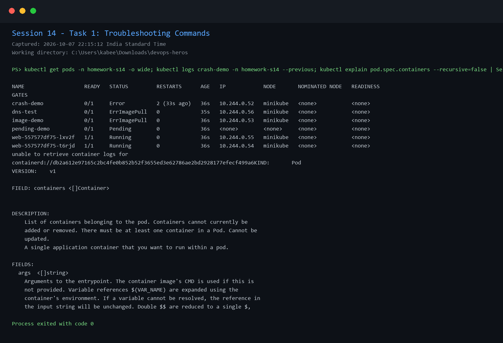
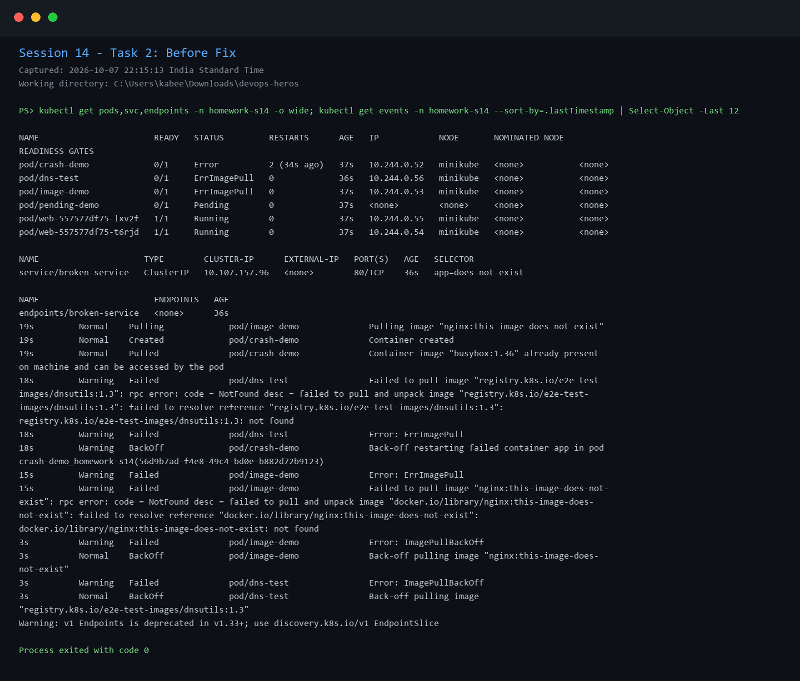
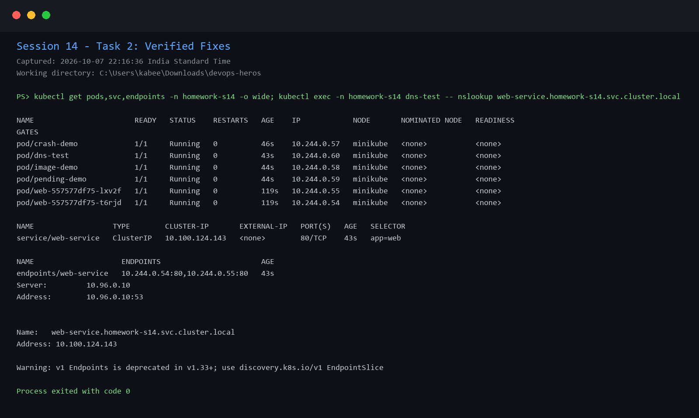
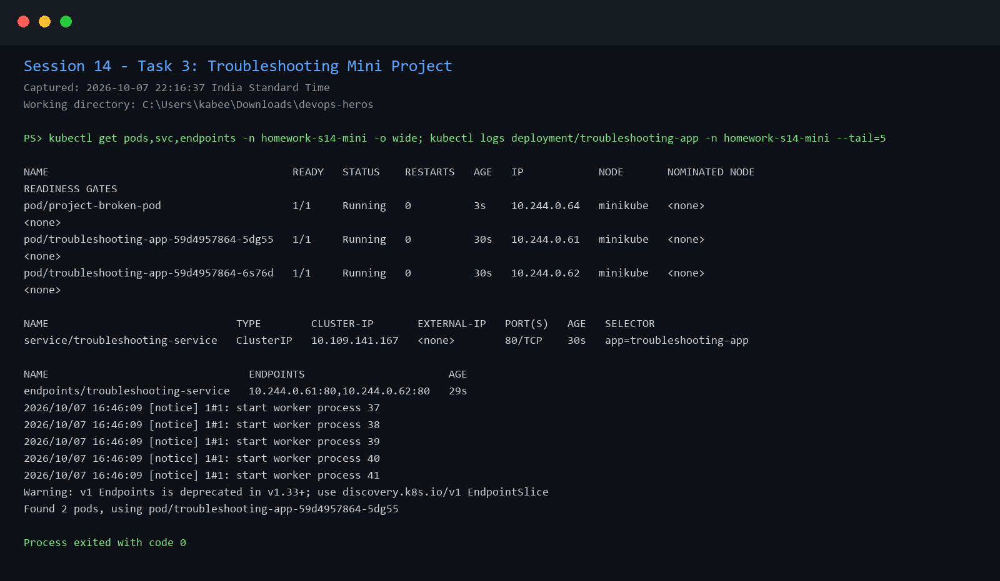

# Session 14: Kubernetes Troubleshooting Homework

## Task 1 - Troubleshooting commands

Practiced `kubectl get`, `describe`, `logs`, `exec`, `events`, `explain`, `top`, and `get -o wide` while investigating an isolated troubleshooting namespace.

## Task 2 - Common issues

The following scenarios were intentionally broken, investigated, fixed, and verified:

- CrashLoopBackOff caused by a container command exiting with code 1.
- ImagePullBackOff and ErrImagePull caused by a nonexistent image tag.
- Pending Pod caused by an impossible node selector.
- Service connectivity failure caused by a selector with no matching Pod labels.
- DNS test failure caused by an outdated test image.

## Task 3 - Mini project

The mini project deployed a healthy application Service alongside an intentionally broken image. The broken image was replaced using `mini-project/fixed-pod.yaml`, then the recovered resources were verified.

