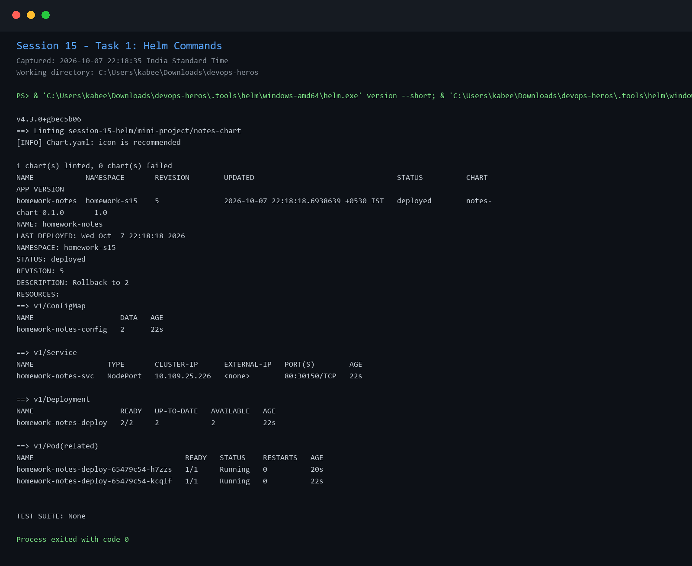
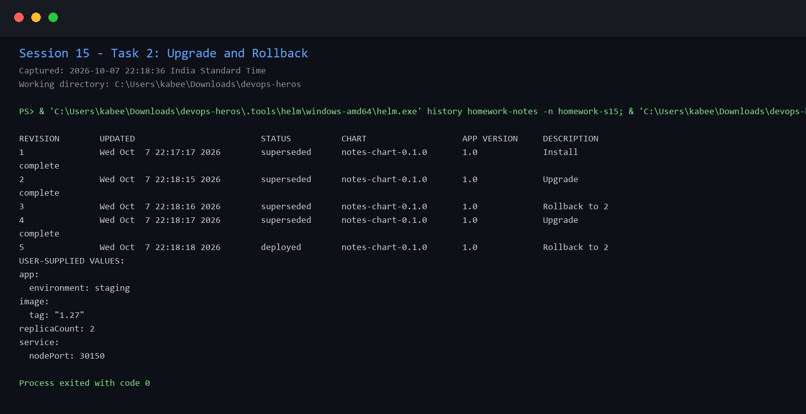
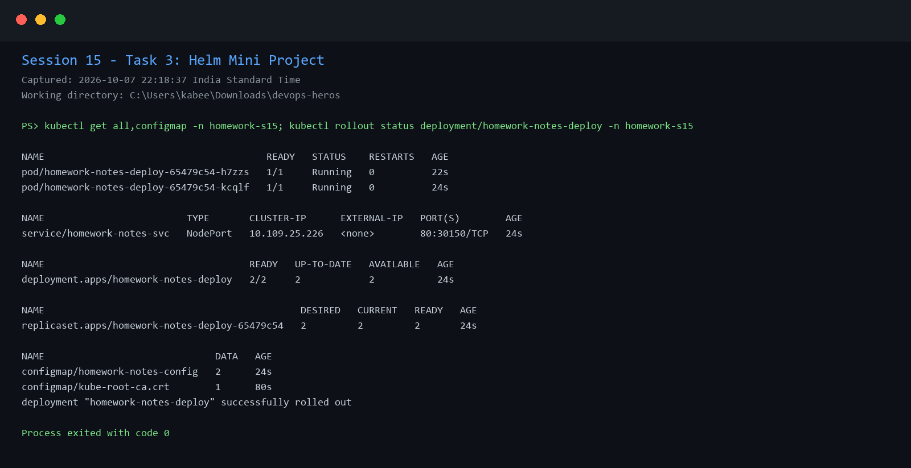

# Session 15: Helm Homework

## Task 1 - Helm commands

Used and documented `helm lint`, `template`, `install`, `list`, `status`, `get values`, `upgrade`, `history`, and `rollback` with the Notes chart mini project.

## Task 2 - Rollback workflow

Completed the workflow: install, upgrade, verify, upgrade again, verify, rollback, and verify. Release history shows the deployed and superseded revisions.

## Task 3 - Mini project

The Notes chart was installed in the isolated `homework-s15` namespace. The chart passed `helm lint`; the release and Kubernetes resources were verified after rollback.

