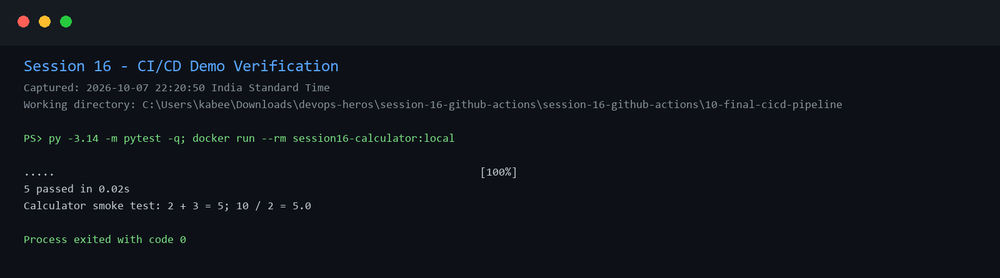

# Session 16: CI/CD and GitHub Actions

## Homework demo

The final demo is in `session-16-github-actions/10-final-cicd-pipeline/`. It contains a Python calculator, tests, build script, Dockerfile, and GitHub Actions workflow.

The workflow covers CI (checkout, dependency installation, test, security check, build, artifact upload) and a CD smoke-test stage. The delivery stage loads the generated image artifact, runs it, and verifies that the container exits successfully.

## Local verification

- 5 calculator tests passed.
- `session16-calculator:local` built successfully.
- The delivery image ran the calculator smoke test successfully.

## Workflow file

`.github/workflows/ci.yml` inside the final project is ready for a GitHub-hosted run. A remote Actions run is intentionally not claimed here because no repository was pushed or authorized for this homework session.
