# Session 10: Kubernetes Core Objects, Lifecycle & Deployment Strategies

**Author:** [Your Name]  
**Course:** SST DevOps & Cloud [SWE]  
**Session:** 10  
**Repository Directory:** `session10-k8s-core-objects`

> **Submission note:** The commands and task structure below are based on the supplied **DevOps Assignment Season 2** Markdown. Obvious URL-formatting artifacts caused by Markdown rendering have been normalized so the shell commands are copyable. Terminal output is machine-specific, so every task contains a placeholder that must be replaced with your real output before submission.


```bash
mkdir -p screenshots
```

The assignment notes that some Session 10 material was continued during later lectures. The task numbering below follows the Session 10 section of the supplied homework file.

---
## Task 1: Cluster Health Verification & Baseline Environment Checks

- **Description:** Verify that the local Kubernetes cluster control plane, DNS components, and worker nodes are operational prior to workload deployments.
- **Commands to Run:**
    
    ```bash
    # Check Kubernetes client and server versions
    kubectl version --output=yaml
    
    # Check control plane and CoreDNS status
    kubectl cluster-info
    
    # Verify all nodes are in Ready status
    kubectl get nodes -o wide
    ```
    
- **Expected Terminal Output:**
    
    ```
    Kubernetes control plane is running at https://127.0.0.1:52554
    CoreDNS is running at https://127.0.0.1:52554/api/v1/namespaces/kube-system/services/kube-dns:dns/proxy
    
    NAME                   STATUS   ROLES           AGE   VERSION
    demo-cluster-control   Ready    control-plane   6d    v1.29.1
    demo-cluster-worker    Ready    <none>          6d    v1.29.1
    ```

### Solution / Observation

The cluster is ready for lab work when the control plane is reachable, CoreDNS is reported by `kubectl cluster-info`, and every node required for the lab shows `Ready`. If a node is `NotReady`, fix the cluster before continuing.

### Actual Terminal Output

Replace the placeholder below with the output from **your own machine**. Do not submit the sample/expected output as if it were your execution.

```text
PASTE YOUR ACTUAL TERMINAL OUTPUT FOR TASK 1 HERE
```

### Screenshot

Combine the required evidence for this task into one screenshot and save it as `screenshots/task1.png`.

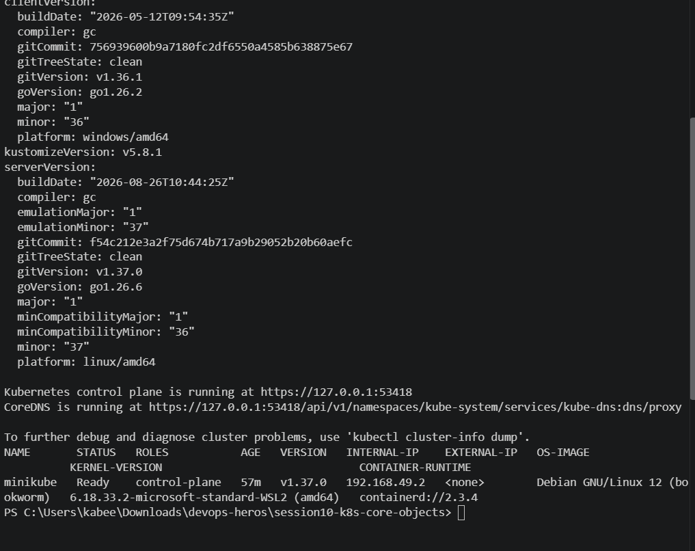

---

## Task 2: Standard Pod Deployment, Extended Inspection & Teardown (`pod.yml`)

- **Description:** Create an individual Pod running Nginx, inspect its labels, runtime IP, node assignment, and container logs, then cleanly delete it.
- **File Reference:** `session10-k8s-core-objects/pod.yml`
- **Commands to Run:**
    
    ```bash
    # Deploy Nginx pod
    kubectl apply -f pod.yml
    
    # Verify Pod readiness (1/1 Running)
    kubectl get pods
    
    # Inspect IP address and assigned worker node
    kubectl get pods -o wide
    
    # Inspect live container logs
    kubectl logs nginx-pod
    
    # Delete pod and confirm termination
    kubectl delete -f pod.yml
    kubectl get pods
    ```

### Solution / Observation

After applying `pod.yml`, the Nginx Pod should become `1/1 Running`. `-o wide` exposes its Pod IP and assigned node, while `kubectl logs` reads container stdout/stderr. Deleting the manifest removes the standalone Pod.

### Actual Terminal Output

Replace the placeholder below with the output from **your own machine**. Do not submit the sample/expected output as if it were your execution.

```text
PASTE YOUR ACTUAL TERMINAL OUTPUT FOR TASK 2 HERE
```

### Screenshot

Combine the required evidence for this task into one screenshot and save it as `screenshots/task2.png`.

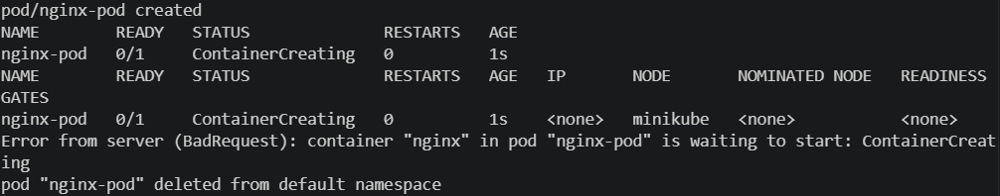

---

## Task 3: Error State Simulation — `ErrImagePull` & `ImagePullBackOff`

- **Description:** Demonstrate Kubernetes error handling when pulling a non-existent container image, observing the exponential backoff loop.
- **File Reference:** `session10-k8s-core-objects/pod-lifecycle/06-imagepullbackoff.yaml` (or manually edited `pod.yml`)
- **Commands to Run:**
    
    ```bash
    # Apply broken image manifest
    kubectl apply -f pod-lifecycle/06-imagepullbackoff.yaml
    
    # Observe failure state
    kubectl get pods lifecycle-image-error
    
    # Inspect failure events recorded by the Kubelet
    kubectl describe pod lifecycle-image-error | grep -A 10 Events:
    
    # Clean up
    kubectl delete -f pod-lifecycle/06-imagepullbackoff.yaml
    ```

### Solution / Observation

The Pod object can be accepted by the API server even though the image cannot be started. The kubelet/container runtime later fails to pull the nonexistent image, first exposing `ErrImagePull` and then retrying with `ImagePullBackOff`.

### Actual Terminal Output

Replace the placeholder below with the output from **your own machine**. Do not submit the sample/expected output as if it were your execution.

```text
PASTE YOUR ACTUAL TERMINAL OUTPUT FOR TASK 3 HERE
```

### Screenshot

Combine the required evidence for this task into one screenshot and save it as `screenshots/task3.png`.

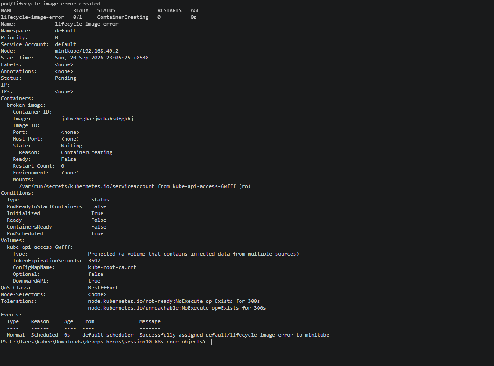

---

## Task 4: Capturing Transient Pod Lifecycle Stages (`hello.yml`)

- **Description:** Deploy a batch execution container (`busybox`) configured with `restartPolicy: Never` and capture all three lifecycle states in real time.
- **File Reference:** `session10-k8s-core-objects/hello.yml`
- **Commands to Run:**
    
    ```bash
    # In Terminal 1: Watch pods continuously
    kubectl get pods -w
    
    # In Terminal 2: Apply batch job
    kubectl apply -f hello.yml
    
    # Rapidly observe states:
    # Stage 1: ContainerCreating (runtime pulling image & configuring netns)
    # Stage 2: Running (process executing)
    # Stage 3: Completed (process terminated with exit code 0)
    kubectl get pods hello-pod
    
    # Verify exit code and logs
    kubectl logs hello-pod
    kubectl delete -f hello.yml
    ```

### Solution / Observation

A short-lived BusyBox Pod with `restartPolicy: Never` moves through creation/running and then terminates successfully. In `kubectl get pods`, a successful finished workload appears as `Completed`; the corresponding Pod phase is `Succeeded`.

### Actual Terminal Output

Replace the placeholder below with the output from **your own machine**. Do not submit the sample/expected output as if it were your execution.

```text
PASTE YOUR ACTUAL TERMINAL OUTPUT FOR TASK 4 HERE
```

### Screenshot

Combine the required evidence for this task into one screenshot and save it as `screenshots/task4.png`.

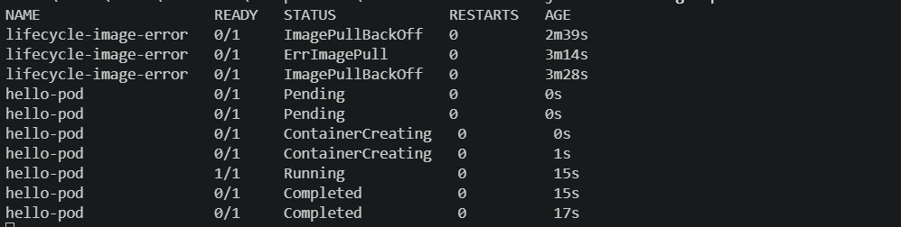

---

## Task 5: Exhaustive Pod Lifecycle States & Probes Lab (`pod-lifecycle/`)

- **Description:** Navigate to `session10-k8s-core-objects/pod-lifecycle/` and validate core lifecycle states, health checks, multi-container pods, and graceful termination.
- **Commands to Run:**
    
    ```bash
    cd session10-k8s-core-objects/pod-lifecycle/
    
    # 1. Pending State (Unschedulable due to impossible memory request)
    kubectl apply -f 02-pending.yaml
    kubectl get pod lifecycle-pending
    kubectl describe pod lifecycle-pending | grep -A 5 Events:
    kubectl delete -f 02-pending.yaml
    
    # 2. CrashLoopBackOff (Container exit code 1 restart loop)
    kubectl apply -f 05-crashloopbackoff.yaml
    kubectl get pod lifecycle-crashloop -w
    kubectl logs lifecycle-crashloop --previous
    kubectl delete -f 05-crashloopbackoff.yaml
    
    # 3. Readiness Probe (Validating Running != Ready)
    kubectl apply -f 07-readiness.yaml
    kubectl get pod lifecycle-readiness
    kubectl delete -f 07-readiness.yaml
    
    # 4. Liveness Probe (Automated restart on health failure)
    kubectl apply -f 08-liveness.yaml
    # Watch for 25-30s until RESTARTS increments to 1
    kubectl get pod lifecycle-liveness -w
    kubectl delete -f 08-liveness.yaml
    
    # 5. Startup Probe (Handling slow bootstrap without premature liveness death)
    kubectl apply -f 09-startup.yaml
    kubectl get pod lifecycle-startup
    kubectl delete -f 09-startup.yaml
    
    # 6. Init Container (Sequential setup completion prior to app start)
    kubectl apply -f 10-init-container.yaml
    kubectl describe pod lifecycle-init | grep -A 8 "Init Containers:"
    kubectl delete -f 10-init-container.yaml
    
    # 7. Multi-Container Pod (Main App + Logging Sidecar)
    kubectl apply -f 11-multi-container.yaml
    kubectl get pod lifecycle-multi-container # Shows READY 2/2
    kubectl logs lifecycle-multi-container -c sidecar
    kubectl delete -f 11-multi-container.yaml
    
    # 8. Graceful Termination (SIGTERM trap handling)
    kubectl apply -f 12-termination.yaml
    kubectl delete -f 12-termination.yaml # Notice 10s delay while handling cleanup
    ```

### Solution / Observation

This lab demonstrates that Kubernetes Pod health is not a single binary state: scheduling pressure, successful/failed termination, repeated crashes, image-pull failures, readiness, liveness, startup protection, init sequencing, sidecars and graceful SIGTERM handling are distinct lifecycle behaviors.

### Actual Terminal Output

Replace the placeholder below with the output from **your own machine**. Do not submit the sample/expected output as if it were your execution.

```text
PASTE YOUR ACTUAL TERMINAL OUTPUT FOR TASK 5 HERE
```

### Screenshot

Combine the required evidence for this task into one screenshot and save it as `screenshots/task5.png`.

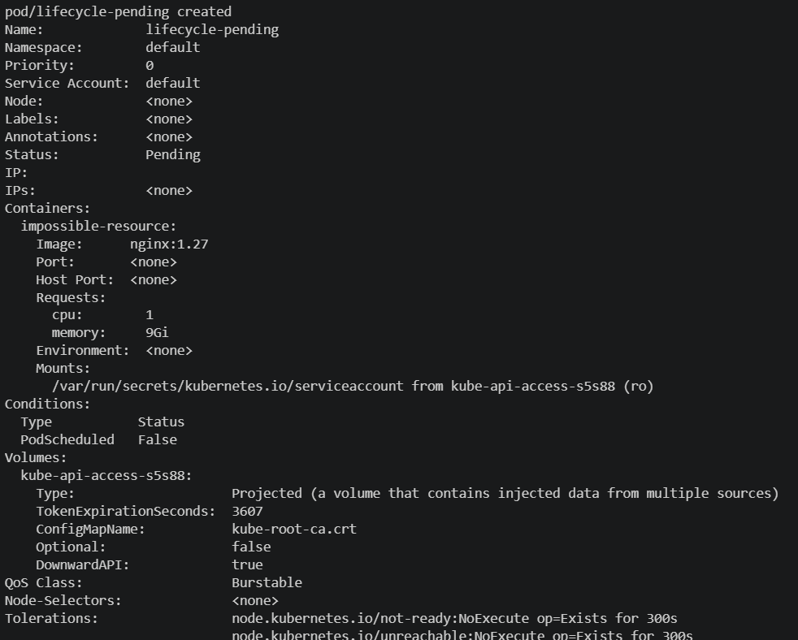

---

## Task 6: Core Controller Objects Exploration (ReplicaSet & StatefulSet)

- **Description:** Deploy self-healing stateless replication via a ReplicaSet and predictable stateful storage via a StatefulSet.
- **Commands to Run:**
    
    #### Part A: ReplicaSet
    
    ```bash
    # Deploy ReplicaSet
    kubectl apply -f session10-k8s-core-objects/replicaset.yml
    kubectl get rs nginx-rs
    kubectl get pods -l app=nginx
    
    # Test Self-Healing: Delete 1 pod manually
    POD_NAME=$(kubectl get pods -l app=nginx -o jsonpath='{.items[0].metadata.name}')
    kubectl delete pod $POD_NAME
    
    # Verify ReplicaSet instantly created a new pod to maintain desired count: 3
    kubectl get pods -l app=nginx
    kubectl delete -f session10-k8s-core-objects/replicaset.yml
    ```
    
    #### Part B: StatefulSet
    
    ```bash
    # Deploy StatefulSet
    kubectl apply -f session10-k8s-core-objects/k8s-core-objects/statefulset.yml
    kubectl get statefulset mysql
    
    # Notice ordinal names: mysql-0, mysql-1, mysql-2
    kubectl get pods -l app=mysql
    kubectl delete -f session10-k8s-core-objects/k8s-core-objects/statefulset.yml
    ```

### Solution / Observation

A ReplicaSet restores the declared replica count after manual Pod deletion, demonstrating reconciliation/self-healing. A StatefulSet preserves ordered identities such as `mysql-0`, `mysql-1`, etc., and its persistent-storage behavior should be verified with the relevant PVCs when present in the manifest.

### Actual Terminal Output

Replace the placeholder below with the output from **your own machine**. Do not submit the sample/expected output as if it were your execution.

```text
PASTE YOUR ACTUAL TERMINAL OUTPUT FOR TASK 6 HERE
```

### Screenshot

Combine the required evidence for this task into one screenshot and save it as `screenshots/task6.png`.

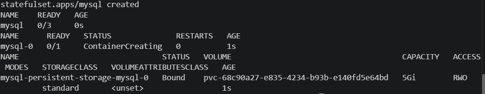

---

## Task 7: DaemonSet Architecture & Host Agent Deployment

- **Description:** Deploy a host agent DaemonSet (`node-exporter` or `node-agent-ds.yaml`), demonstrating that exactly one pod runs on each eligible cluster node.
- **Commands to Run:**
    
    ```bash
    # Deploy DaemonSet
    kubectl apply -f session10-k8s-core-objects/k8s-core-objects/deamonset.yml
    
    # Verify DaemonSet status
    kubectl get ds node-exporter
    
    # Inspect pod distribution across nodes
    kubectl get pods -l app=node-exporter -o wide
    kubectl delete -f session10-k8s-core-objects/k8s-core-objects/deamonset.yml
    ```

### Solution / Observation

A DaemonSet targets eligible nodes rather than an arbitrary replica count. The expected observation is one DaemonSet Pod per eligible node, visible by comparing `kubectl get ds` with `kubectl get pods -o wide`.

### Actual Terminal Output

Replace the placeholder below with the output from **your own machine**. Do not submit the sample/expected output as if it were your execution.

```text
PASTE YOUR ACTUAL TERMINAL OUTPUT FOR TASK 7 HERE
```

### Screenshot

Combine the required evidence for this task into one screenshot and save it as `screenshots/task7.png`.

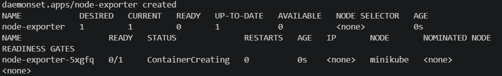

---

## Task 8: Deployment Upgrades, Rolling Updates & Instant Rollbacks

- **Description:** Demonstrate declarative zero-downtime rolling updates using `maxSurge: 1` and `maxUnavailable: 0`, and execute an immediate rollback.
- **Commands to Run:**
    
    ```bash
    cd session10-k8s-core-objects/01-rolling-update/
    
    # 1. Deploy Version 1
    kubectl apply -f deployment-v1.yaml
    kubectl apply -f service.yaml
    kubectl rollout status deployment/app-rolling
    
    # 2. Trigger Rolling Update to Version 2
    kubectl apply -f deployment-v2.yaml
    
    # 3. Track rollout progress
    kubectl rollout status deployment/app-rolling
    kubectl get pods -l app=app-rolling --show-labels
    
    # 4. Check rollout history
    kubectl rollout history deployment/app-rolling
    
    # 5. Execute Rollback to previous revision
    kubectl rollout undo deployment/app-rolling
    kubectl rollout status deployment/app-rolling
    
    # Cleanup
    kubectl delete -f service.yaml -f deployment-v1.yaml
    ```

### Solution / Observation

The v2 manifest triggers a controlled rolling replacement. With `maxSurge: 1` and `maxUnavailable: 0`, Kubernetes can create one extra Pod while keeping the full desired availability. `rollout undo` returns the Deployment to the preceding revision.

### Actual Terminal Output

Replace the placeholder below with the output from **your own machine**. Do not submit the sample/expected output as if it were your execution.

```text
PASTE YOUR ACTUAL TERMINAL OUTPUT FOR TASK 8 HERE
```

### Screenshot

Combine the required evidence for this task into one screenshot and save it as `screenshots/task8.png`.

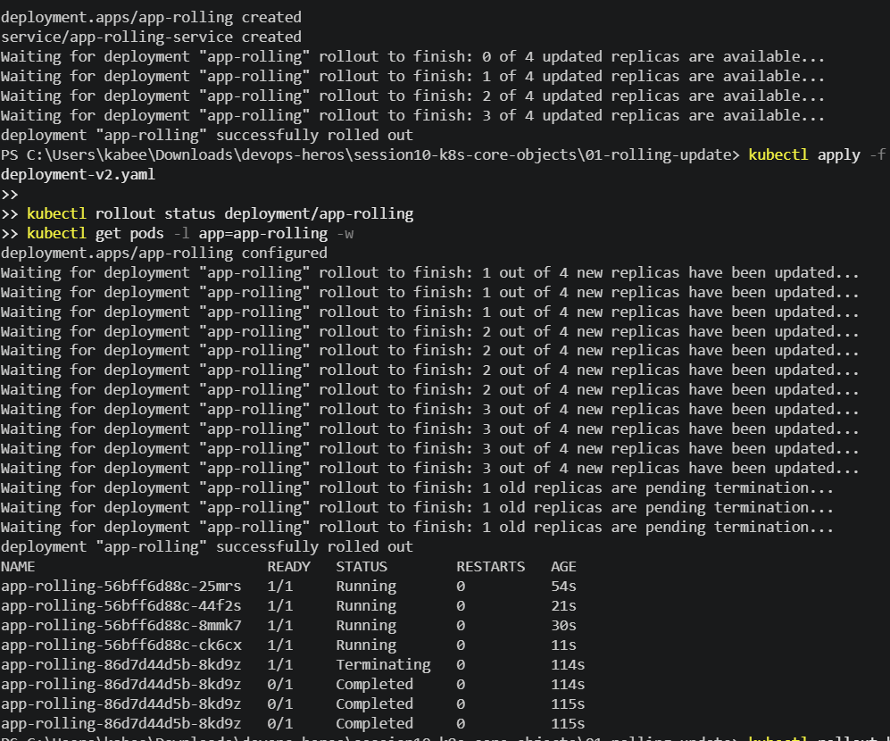

---

## Task 9: Real-World Troubleshooting Scenarios Lab (`troubleshooting/`)

- **Description:** Resolve an in-flight rollout failure caused by an unresolvable image tag, and debug an API server rejection caused by an immutable selector label mismatch.
- **Commands to Run:**
    
    #### Drill 1: Broken Image Rollout Failure
    
    ```bash
    cd session10-k8s-core-objects/troubleshooting/
    
    # Trigger broken deployment rollout
    kubectl apply -f broken-image.yaml
    
    # Notice rollout stalls because new pod cannot pull image
    kubectl rollout status deployment/yatri-backend --timeout=30s
    kubectl get pods -l app=yatri-backend
    
    # Recover by undoing the broken revision
    kubectl rollout undo deployment/yatri-backend
    kubectl delete -f broken-image.yaml
    ```
    
    #### Drill 2: Immutable Selector Mismatch Rejection
    
    ```bash
    # Attempt to apply invalid selector manifest
    kubectl apply -f selector-mismatch.yaml
    # Expected Error: The Deployment "selector-error-demo" is invalid:
    # spec.template.metadata.labels: Invalid value: ... doesn't match selector
    ```
    
    *Fix:* Edit `selector-mismatch.yaml` so `spec.template.metadata.labels.app` matches `spec.selector.matchLabels.app`, then re-apply successfully.

### Solution / Observation

In the broken-image drill, the rollout stalls because newly created Pods cannot pull their image; rollback restores the previous healthy revision. In the selector drill, the Pod-template labels must satisfy the Deployment selector or the API server rejects the manifest.

### Actual Terminal Output

Replace the placeholder below with the output from **your own machine**. Do not submit the sample/expected output as if it were your execution.

```text
PASTE YOUR ACTUAL TERMINAL OUTPUT FOR TASK 9 HERE
```

### Screenshot

Combine the required evidence for this task into one screenshot and save it as `screenshots/task9.png`.

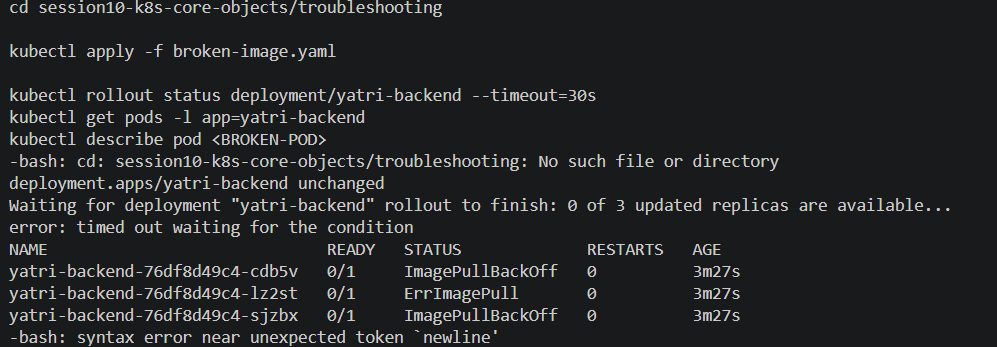

---

## Task 10: Theoretical & Architectural Conceptual Writeup

- **Description:** Provide technical writeups addressing core Kubernetes architectural interview questions directly in your `README.md`.
- **Key Deliverables to Include in `README.md`:**
    1. **The 4 Ports Clarified:**
        - `containerPort`: Port opened inside the application container process (informational in PodSpec).
        - `targetPort`: Port on the backend pod where the Kubernetes Service routes incoming traffic.
        - `port`: Port exposed internally by the Kubernetes Service (ClusterIP).
        - `nodePort`: Static high port (`30000–32767`) exposed across every worker node's external IP.
    2. **Labels vs. Selectors:**
        - *Labels*: Key-value pairs attached to objects (e.g., `app: nginx`, `env: prod`) for metadata identification.
        - *Selectors*: Query filters used by controllers (Deployments, Services) to group and route to matching labelled pods.
    3. **The 4 Deployment Strategies:**
        - *RollingUpdate*: Progressively replaces old pods with new pods; zero downtime.
        - *Recreate*: Kills all v1 pods before starting any v2 pods; causes brief downtime, but avoids version conflicts.
        - *Blue-Green*: Deploys two complete environments (Blue=Live, Green=New); cutover and rollback happen instantly via service selector flip. Requires 2x compute capacity.
        - *Canary*: Deploys a small fraction of v2 pods (e.g., 10%) alongside v1 stable pods to validate real-world production metrics prior to full rollout.
    4. **`maxSurge` vs. `maxUnavailable` Math:**
        - For `replicas: 4`, `maxSurge: 1`, `maxUnavailable: 0`:
            - Max allowed pods during rollout: $4 + 1 = 5$.
            - Min available pods: $4 - 0 = 4$ (Guarantees 100% service capacity throughout rollout).
    5. **Resource Requests vs. Limits & Units:**
        - *Requests*: Guaranteed minimum CPU/memory allocated by the scheduler to place the pod on a node.
        - *Limits*: Maximum ceiling enforced by Linux cgroups. CPU throttling occurs if CPU limit is exceeded; container is OOM-killed if memory limit is exceeded.
        - *Units*: 1 GB = $10^9$ bytes (decimal, SI); 1 GiB = $2^{30}$ bytes = $1,073,741,824$ bytes (binary, IEC). Kubernetes uses mebibytes (`Mi`) and gibibytes (`Gi`).

### Solution / Observation

The conceptual write-up below is the solution: Service ports describe different points in the traffic path, labels are metadata while selectors match that metadata, deployment strategies trade capacity/risk/downtime differently, and requests/limits have different scheduling/runtime roles.

### Actual Terminal Output

Replace the placeholder below with the output from **your own machine**. Do not submit the sample/expected output as if it were your execution.

```text
PASTE YOUR ACTUAL TERMINAL OUTPUT FOR TASK 10 HERE
```

### Screenshot

Combine the required evidence for this task into one screenshot and save it as `screenshots/task10.png`.


---

## Task 11: Blue-Green Deployment Execution & Instant Selector Cutover

- **Description:** Deploy the Blue and Green deployments side-by-side. Validate that traffic is initially 100% Blue, flip the Service label selector to point to Green, observe the instantaneous change in `Endpoints`, and execute an immediate rollback.
- **Directory Reference:** `session10-k8s-core-objects/02-blue-green/`
- **Commands to Run:**
    
    ```bash
    cd session10-k8s-core-objects/02-blue-green/
    
    # 1. Deploy both environments side-by-side (6 pods total)
    kubectl apply -f deployment-blue.yaml
    kubectl apply -f deployment-green.yaml
    
    # 2. Verify both Blue and Green pods are Running
    kubectl get pods -l app=myapp --show-labels
    
    # 3. Route live traffic to Blue (v1)
    kubectl apply -f service-blue.yaml
    kubectl describe svc myapp-service | grep Selector
    kubectl get endpoints myapp-service
    
    # 4. Test live traffic — verify Blue responds
    curl -s http://localhost:30020 | grep "ENVIRONMENT"
    # (On Minikube use: curl -s http://$(minikube ip):30020 | grep "ENVIRONMENT")
    
    # 5. THE SWITCH: Flip traffic to Green (v2) instantly
    kubectl apply -f service-green.yaml
    
    # 6. Verify selector and endpoints updated immediately to Green pods
    kubectl describe svc myapp-service | grep Selector
    kubectl get endpoints myapp-service
    
    # 7. Test live traffic — verify Green now responds
    curl -s http://localhost:30020 | grep "ENVIRONMENT"
    
    # 8. Instant Rollback: Flip selector back to Blue
    kubectl apply -f service-blue.yaml
    curl -s http://localhost:30020 | grep "ENVIRONMENT"
    
    # Cleanup
    kubectl delete -f service-blue.yaml -f deployment-blue.yaml -f deployment-green.yaml
    ```
    
- **Expected Terminal Output:**
    
    ```
    # Before switch:
    Selector:   app=myapp,slot=blue
    <p>BLUE ENVIRONMENT</p>
    
    # After switch:
    service/myapp-service configured
    Selector:   app=myapp,slot=green
    <p>GREEN ENVIRONMENT</p>
    ```

### Solution / Observation

Blue and Green run simultaneously, but the Service selector points to only one slot at a time. Applying the Green Service definition moves all selected endpoints to Green; re-applying the Blue selector performs the immediate rollback.

### Actual Terminal Output

Replace the placeholder below with the output from **your own machine**. Do not submit the sample/expected output as if it were your execution.

```text
PASTE YOUR ACTUAL TERMINAL OUTPUT FOR TASK 11 HERE
```

### Screenshot

Combine the required evidence for this task into one screenshot and save it as `screenshots/task11.png`.

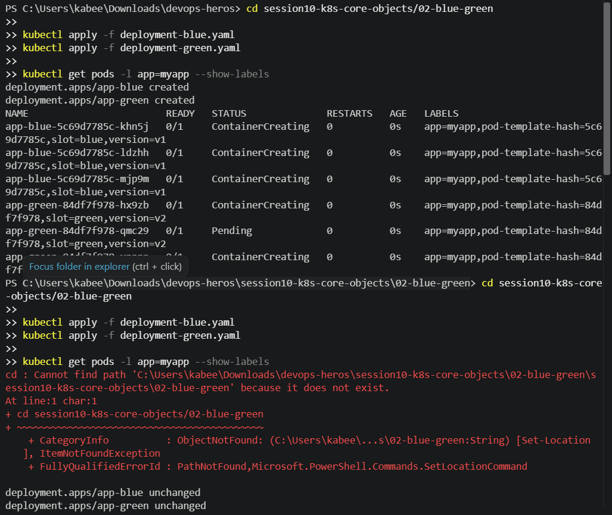

---

## Task 12: Canary Deployment Execution & Pod-Ratio Traffic Splitting

- **Description:** Deploy a 9-replica stable deployment and a 1-replica canary deployment under the same Service. Run a curl loop to capture the approximate 10% canary traffic ratio, scale the canary to increase traffic share, and execute a rollback by scaling the canary to zero.
- **Directory Reference:** `session10-k8s-core-objects/03-canary/`
- **Commands to Run:**
    
    ```bash
    cd session10-k8s-core-objects/03-canary/
    
    # 1. Deploy Stable baseline (9 pods = 90%) and Service
    kubectl apply -f deployment-stable.yaml
    kubectl apply -f service.yaml
    kubectl rollout status deployment/app-stable
    
    # 2. Deploy Canary release (1 pod = 10%)
    kubectl apply -f deployment-canary.yaml
    kubectl rollout status deployment/app-canary
    
    # 3. Verify total pool has 10 pods (9 stable + 1 canary)
    kubectl get pods -l app=myapp-canary --show-labels
    
    # 4. Verify the Service endpoints list contains all 10 pod IPs
    kubectl get endpoints myapp-canary-service
    
    # 5. Run traffic test loop (20 requests) to verify ~10% canary hits
    for i in $(seq 1 20); do curl -s http://localhost:30030 | grep -o "STABLE v1\|CANARY v2"; done
    # (On Minikube use: curl -s http://$(minikube ip):30030 | grep -o "STABLE v1\|CANARY v2")
    
    # 6. Increase Canary traffic to 30% (scale canary to 3, stable to 7)
    kubectl scale deployment app-canary --replicas=3
    kubectl scale deployment app-stable --replicas=7
    kubectl get endpoints myapp-canary-service
    
    # 7. Rollback: Abort canary release by scaling canary to 0
    kubectl scale deployment app-canary --replicas=0
    kubectl scale deployment app-stable --replicas=9
    
    # Verify 100% of traffic is returned to stable
    for i in $(seq 1 5); do curl -s http://localhost:30030 | grep -o "STABLE v1\|CANARY v2"; done
    
    # Cleanup
    kubectl delete -f service.yaml -f deployment-canary.yaml -f deployment-stable.yaml
    ```
    
- **Expected Terminal Output:**
    
    ```
    STABLE v1
    STABLE v1
    STABLE v1
    CANARY v2    <-- Canary absorbs ~10% of total incoming requests
    STABLE v1
    STABLE v1
    STABLE v1
    STABLE v1
    STABLE v1
    STABLE v1
    ```

### Solution / Observation

Both stable and canary Pods share the same Service selector, so endpoint count approximates traffic share. A 9:1 Pod ratio approximates 90/10 distribution; scaling the two Deployments changes the ratio, and scaling canary to zero aborts the canary release.

### Actual Terminal Output

Replace the placeholder below with the output from **your own machine**. Do not submit the sample/expected output as if it were your execution.

```text
PASTE YOUR ACTUAL TERMINAL OUTPUT FOR TASK 12 HERE
```

### Screenshot

Combine the required evidence for this task into one screenshot and save it as `screenshots/task12.png`.

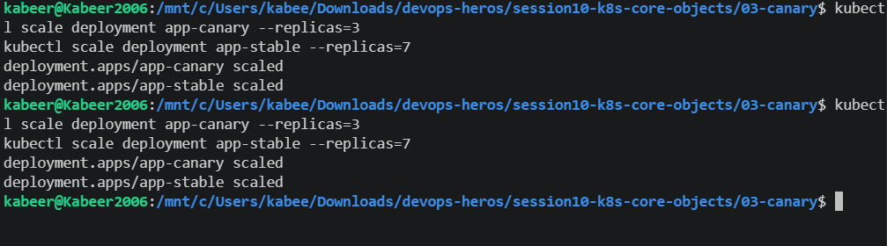

---

## Task 13: Recreate Deployment Execution & Downtime Outage Demonstration

- **Description:** Deploy an application with `strategy.type: Recreate`. Stream live requests during an update to observe and capture the intentional downtime window where 0 pods exist between v1 termination and v2 creation.
- **Directory Reference:** `session10-k8s-core-objects/04-recreate/`
- **Commands to Run:**
    
    ```bash
    cd session10-k8s-core-objects/04-recreate/
    
    # 1. Deploy Version 1 and NodePort Service
    kubectl apply -f deployment-v1.yaml
    kubectl apply -f service.yaml
    kubectl rollout status deployment/app-recreate
    
    # 2. Verify 3 v1 pods are running
    kubectl get pods -l app=app-recreate
    
    # 3. Open Terminal 1 to watch pod state changes in real time
    kubectl get pods -l app=app-recreate -w
    
    # 4. Open Terminal 2 and start a continuous curl polling loop
    while true; do curl -s --connect-timeout 1 http://localhost:30040 | grep -o 'VERSION: [^<]*' || echo "[OUTAGE] Connection refused / 0 pods alive"; sleep 0.5; done
    # (On Minikube use port 30040 with $(minikube ip))
    
    # 5. In Terminal 3: Trigger the Recreate update to v2
    kubectl apply -f deployment-v2.yaml
    
    # 6. Observe the curl loop output in Terminal 2 switch from v1 -> [OUTAGE] -> v2
    
    # 7. Check rollout history and test rollback
    kubectl rollout history deployment/app-recreate
    kubectl rollout undo deployment/app-recreate
    kubectl rollout status deployment/app-recreate
    
    # Cleanup
    kubectl delete -f service.yaml -f deployment-v2.yaml
    ```
    
- **Expected Terminal Output:**
    
    ```
    VERSION: v1
    VERSION: v1
    [OUTAGE] Connection refused / 0 pods alive
    [OUTAGE] Connection refused / 0 pods alive
    [OUTAGE] Connection refused / 0 pods alive
    VERSION: v2 (UPGRADED)
    VERSION: v2 (UPGRADED)
    ```

### Solution / Observation

`Recreate` deliberately terminates the old replica set before bringing up the new one. The continuous request loop should therefore capture a temporary outage between v1 and v2, unlike a zero-downtime rolling update.

### Actual Terminal Output

Replace the placeholder below with the output from **your own machine**. Do not submit the sample/expected output as if it were your execution.

```text
PASTE YOUR ACTUAL TERMINAL OUTPUT FOR TASK 13 HERE
```

### Screenshot

Combine the required evidence for this task into one screenshot and save it as `screenshots/task13.png`.

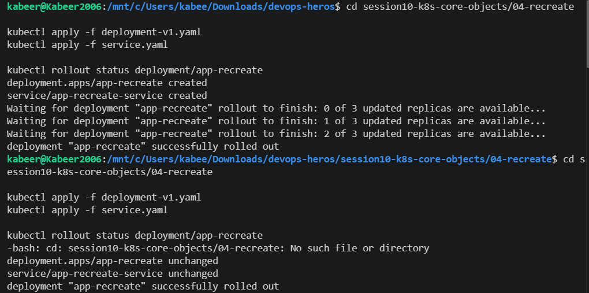

---

## Final Submission Checklist

- [ ] `screenshots/task1.png` exists and contains the required evidence for Task 1.
- [ ] `screenshots/task2.png` exists and contains the required evidence for Task 2.
- [ ] `screenshots/task3.png` exists and contains the required evidence for Task 3.
- [ ] `screenshots/task4.png` exists and contains the required evidence for Task 4.
- [ ] `screenshots/task5.png` exists and contains the required evidence for Task 5.
- [ ] `screenshots/task6.png` exists and contains the required evidence for Task 6.
- [ ] `screenshots/task7.png` exists and contains the required evidence for Task 7.
- [ ] `screenshots/task8.png` exists and contains the required evidence for Task 8.
- [ ] `screenshots/task9.png` exists and contains the required evidence for Task 9.
- [ ] `screenshots/task10.png` exists and contains the required evidence for Task 10.
- [ ] `screenshots/task11.png` exists and contains the required evidence for Task 11.
- [ ] `screenshots/task12.png` exists and contains the required evidence for Task 12.
- [ ] `screenshots/task13.png` exists and contains the required evidence for Task 13.
- [ ] Every `PASTE YOUR ACTUAL TERMINAL OUTPUT` placeholder has been replaced.
- [ ] The README and referenced manifests are committed to GitHub.
