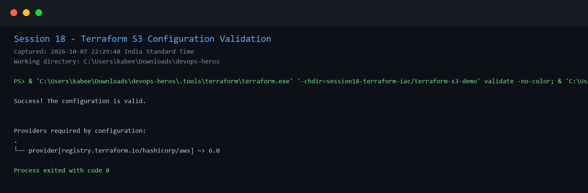
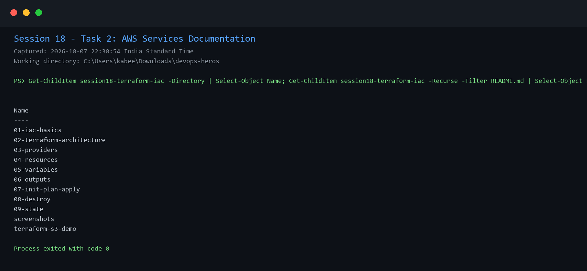

# Session 18: Terraform and Infrastructure as Code

## Task 1 - Terraform S3 demo

`terraform-s3-demo/` contains the requested provider, variables, resource, outputs, and README. It creates a tagged S3 bucket and documents the standard workflow: `init`, `fmt`, `validate`, `plan`, `apply`, `show`, `output`, and `destroy`.

The configuration initialized and validated locally without applying cloud resources.



## Task 2 - AWS services research

The topic folders document IAM, EC2, S3, VPC, and database concepts. They cover least privilege, EC2 lifecycle, S3 lifecycle/encryption, VPC networking controls, DynamoDB data modelling, and RDS resilience.



## Safe execution

```bash
cd terraform-s3-demo
terraform init
terraform fmt
terraform validate
terraform plan
# only with configured AWS credentials and a unique bucket name:
terraform apply
terraform destroy
```
