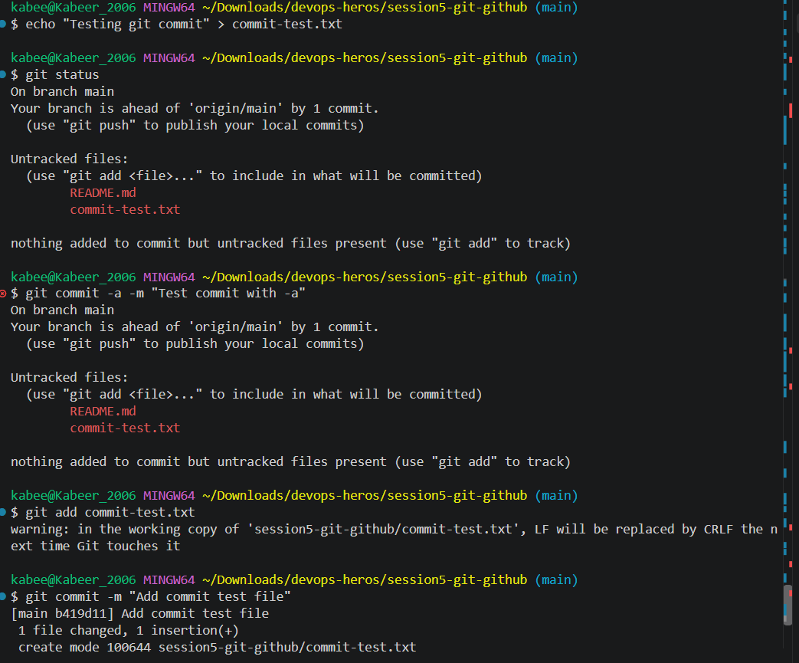
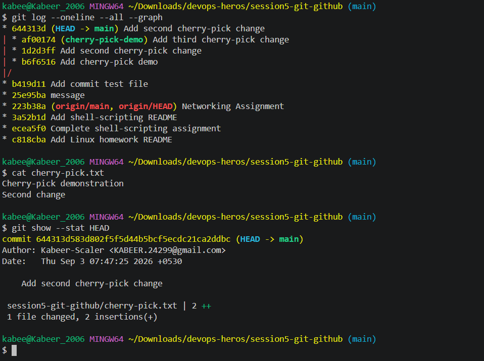

# Git & GitHub Assignment

## Task 1: git commit -m vs git commit -a -m

Practiced the difference between `git commit -m` and `git commit -a -m`.

### git commit -m

`git commit -m` commits files that have already been staged using `git add`.

### git commit -a -m

`git commit -a -m` automatically stages modified and deleted tracked files before committing.

It does not automatically stage new untracked files.

## Task 2: Git Cherry-Pick

Created a separate `cherry-pick-demo` branch and made three commits on it.

The second commit was selected and cherry-picked into the `main` branch.

The cherry-pick created a new commit on `main` containing the changes from the selected commit.

### Verification

Used `git log --oneline --all --graph` to verify the branch history and cherry-picked commit.

