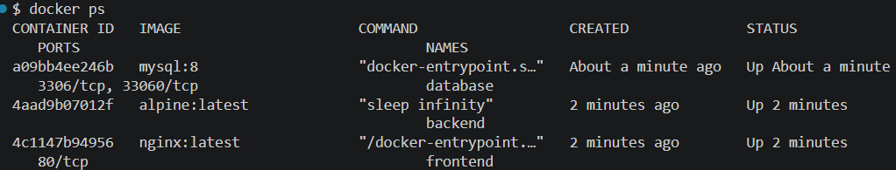
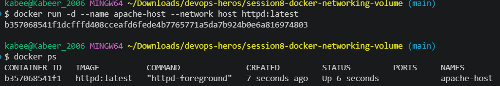
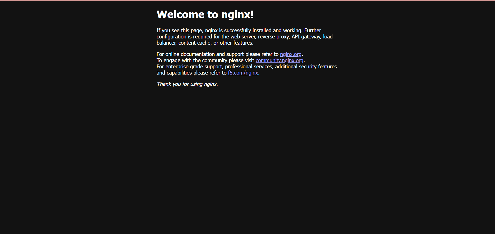
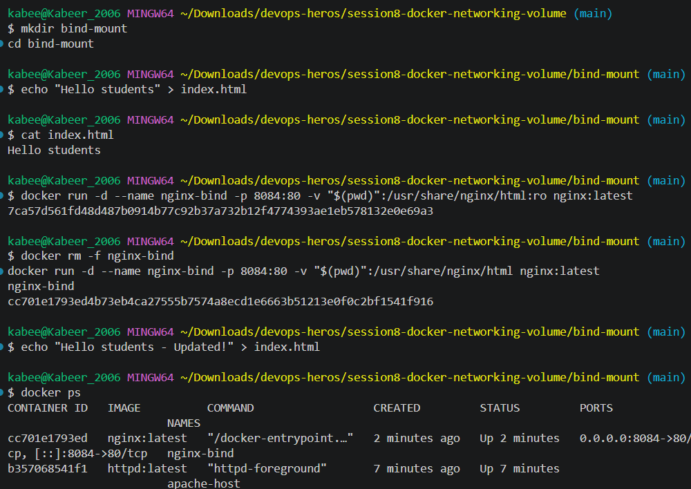

# Docker Networking & Volume Assignment

## Task 1: Docker Container Networking




## Task 2: Host Network



## Task 3: Bind Mount




## Task 4: Overlay Network

An overlay network is a Docker network that connects containers and services running on multiple Docker hosts.

### Use Cases

- Communication between containers running on different Docker hosts.
- Connecting services in a Docker Swarm cluster.
- Multi-host microservice deployments.
- Service-to-service communication across Swarm nodes.

### How Overlay Networks Work

An overlay network is created using Docker's overlay network driver. Docker Swarm provides coordination between hosts, allowing containers on different Docker hosts to communicate over the same logical network.

Example:

```bash
docker swarm init
docker network create --driver overlay --attachable my-overlay
