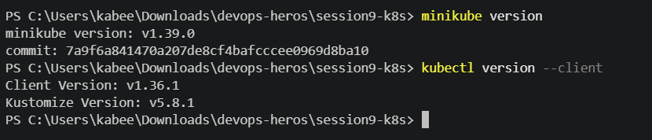
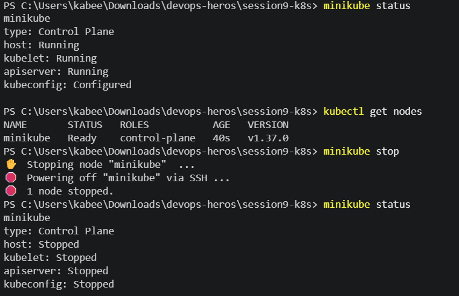

# Session 9: Kubernetes Fundamentals & Cluster Architecture

**Author:** [Your Name]  
**Course:** SST DevOps & Cloud [SWE]  
**Session:** 09 - Kubernetes Fundamentals  
**Repository:** `devops-heros/session9-k8s`

> **Submission note:** The commands and task structure below are based on the supplied **DevOps Assignment Season 2** Markdown. Obvious URL-formatting artifacts caused by Markdown rendering have been normalized so the shell commands are copyable. Terminal output is machine-specific, so every task contains a placeholder that must be replaced with your real output before submission.


Create the screenshot folder once before starting:

```bash
mkdir -p screenshots
```

---

## Task 1: Minikube Installation & Environment Setup

### Description
Install/verify `minikube` and `kubectl` on the local machine and confirm that both CLIs are available through version checks.

### Commands

```bash
minikube version
kubectl version --client
```

### Solution / Observation
A successful setup prints a Minikube version and a Kubernetes client version without `command not found` or executable-path errors. This establishes that the local CLI prerequisites for the remaining Kubernetes labs are available.

### Actual Terminal Output

```text
PASTE YOUR ACTUAL TERMINAL OUTPUT FOR TASK 1 HERE
```

### Screenshot

Save the terminal evidence as `screenshots/task1.png`.



---

## Task 2: Minikube Cluster Lifecycle Execution

### Description
Start the local Kubernetes cluster, verify the control-plane/node health, and stop the cluster cleanly.

### Commands

```bash
# Start cluster
minikube start

# Verify cluster components and node readiness
minikube status
kubectl get nodes -o wide

# Stop cluster cleanly
minikube stop
minikube status
```

### Solution / Observation
While the cluster is active, `minikube status` should report the host, kubelet and API server as running, and `kubectl get nodes -o wide` should show the Minikube node in `Ready` state. After `minikube stop`, the status should show the cluster components stopped while the kubeconfig remains configured.

### Actual Terminal Output

```text
PASTE YOUR ACTUAL TERMINAL OUTPUT FOR TASK 2 HERE
```

### Screenshot

Capture the start, healthy status/node state and final stopped status together (or combine terminal captures into one image) and save it as `screenshots/task2.png`.



---

## Task 3: Kubernetes Architecture & Core Components

### Description
Document the Control Plane (Master) and Worker Node components, what each component does, and how they interact.

### Architecture

```text
+-----------------------------------------------------------------------+
|                         CONTROL PLANE                                 |
|                                                                       |
|  +-------------+      +------------------+      +-----------------+   |
|  |    etcd     |<---->|  kube-apiserver  |<---->| kube-scheduler  |   |
|  +-------------+      +--------+---------+      +-----------------+   |
|                               |                                       |
|                               v                                       |
|                    +-------------------------+                        |
|                    | kube-controller-manager |                        |
|                    +-------------------------+                        |
+-------------------------------+---------------------------------------+
                                |
                                v
+-----------------------------------------------------------------------+
|                          WORKER NODE                                  |
|                                                                       |
|   +-----------+     +------------+     +--------------------------+   |
|   |  kubelet  |     | kube-proxy |     | Container Runtime (CRI) |   |
|   +-----+-----+     +------------+     +------------+-------------+   |
|         |                                         |                    |
|         +-----------------------------------------+                    |
|                                                   v                    |
|                                              +---------+               |
|                                              |  Pods   |               |
|                                              +---------+               |
+-----------------------------------------------------------------------+
```

### Control Plane Components

- **`kube-apiserver`**: The main API entry point. `kubectl` and Kubernetes components communicate with the cluster through the API server.
- **`etcd`**: Distributed key-value store containing Kubernetes cluster state, object specifications and metadata.
- **`kube-scheduler`**: Watches for unscheduled Pods and selects suitable nodes using resource requirements and scheduling constraints.
- **`kube-controller-manager`**: Runs reconciliation loops that continuously move the actual cluster state toward the declared desired state.

### Worker Node Components

- **`kubelet`**: Node agent that receives Pod specifications and ensures the required containers are running.
- **`kube-proxy`**: Maintains networking rules used by Kubernetes Services to route traffic to Pods.
- **Container Runtime / CRI**: Actually runs containers; examples mentioned in the assignment include `containerd` and `CRI-O`.
- **Pod**: The smallest deployable Kubernetes unit. A Pod can contain one or more tightly coupled containers sharing networking and storage resources.

### How the Components Interact

1. A user submits desired state using `kubectl` to the API server.
2. The API server validates the request and persists cluster state in `etcd`.
3. The scheduler selects a suitable node for unscheduled Pods.
4. Controllers continuously compare desired and actual state and request corrective changes when required.
5. The worker-node kubelet observes assigned Pod specifications and asks the container runtime to create the containers.
6. `kube-proxy` maintains Service networking rules so traffic can reach the appropriate Pods.

### Commands / Reference Check

```bash
kubectl cluster-info
kubectl get nodes -o wide
```

### Actual Terminal Output

```text
PASTE YOUR ACTUAL TERMINAL OUTPUT FOR TASK 3 HERE
```

### Screenshot

Save your architecture/documentation evidence or the supporting cluster-information terminal view as `screenshots/task3.png`.


---

## Submission Checklist

- [ ] `README.md` is inside `session9-k8s/`.
- [ ] `screenshots/task1.png` exists.
- [ ] `screenshots/task2.png` exists.
- [ ] `screenshots/task3.png` exists.
- [ ] Every terminal-output placeholder has been replaced with real local output.
- [ ] Changes have been committed and pushed to GitHub.

```bash
git add session9-k8s/
git commit -m "Submit Session 9 Kubernetes fundamentals and Minikube setup"
git push origin main
```
